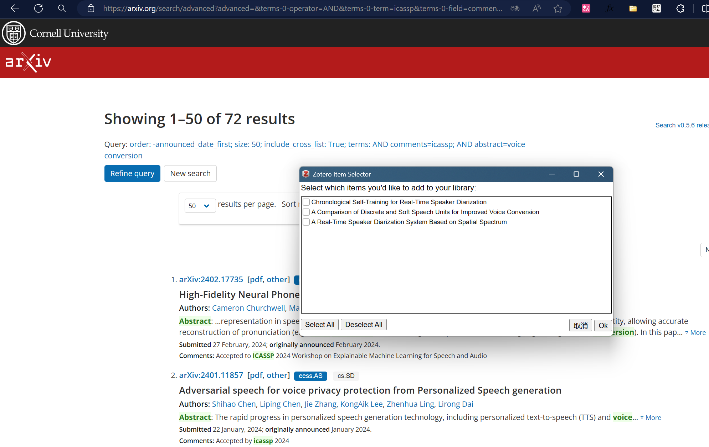
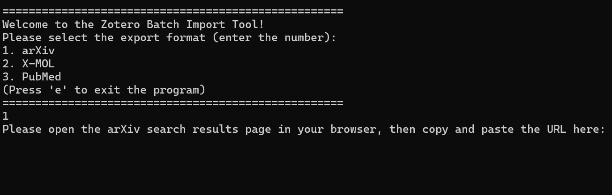
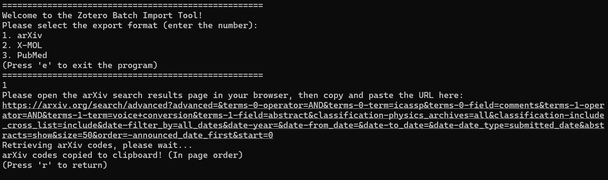
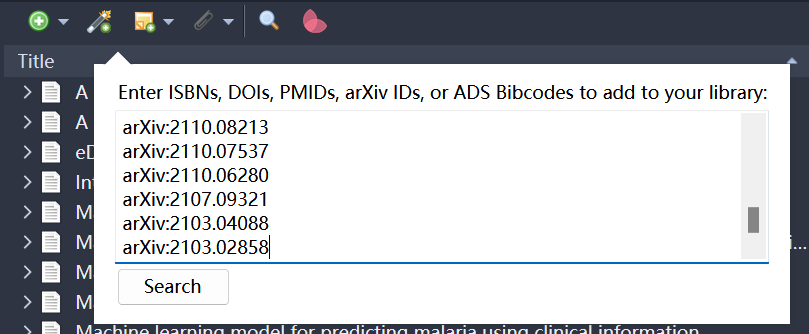

# Zotero Pagewise Import Tool 
This tool provides a method to import all papers from a certain paper search page into `Zotero` (solving the issue of `Zotero's Edge plugin` failing to import all `arXiv` papers from a search page).

## Problem Solved by This Tool

Currently, the `Zotero Connector` plugin in `Edge` is **unable** to import all papers from an `arXiv` search page with its one-click import feature. As shown in the screenshot below, out of fifty papers on one page, only up to three can be imported. 

This limitation poses challenges for researchers in STEM fields when trying to retrieve all the latest papers in a specific domain, journal, or conference. This tool employs a crawler-based approach to effectively address this issue.

## Instructions for Using This Tool

- **STEP 1**:

  Open the tool, select the database website you want to retrieve from, and enter its corresponding number.

  

- **STEP 2**:

  Enter the full URL of the website displaying the search results of the completed search for papers you wish to import into the tool, then it will automatically initiate the crawling process.

  

- **STEP 3**:

  After the tool completes crawling, it saves the results to the clipboard. Paste the clipboard content into `Zotero`'s import folder under `Add Item by Identifier` and click `search`. `Zotero` will then automatically import all the references from the clipboard.

  

## Releases

Presently, this tool is available in both `English` and `Chinese` versions for your convenience.
